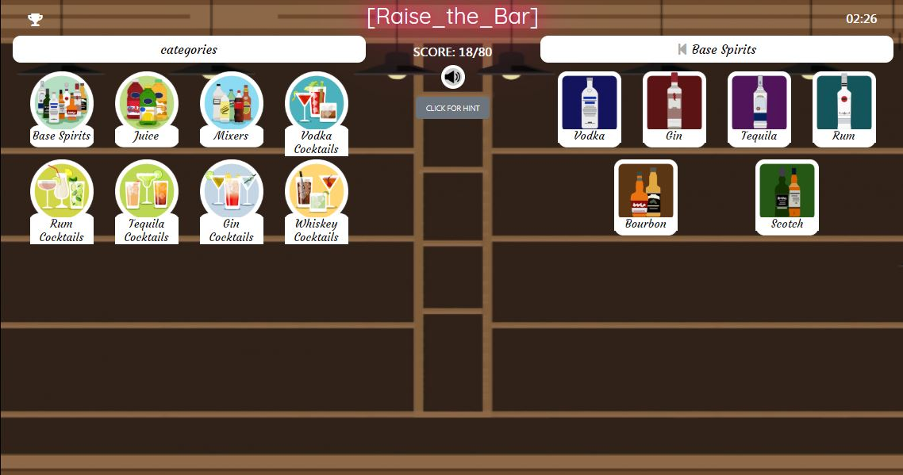

# Raise the Bar

This is a logic-clicking game where the player is a bartender who makes cocktails. The inspiration for this game came from the [Doodle God](http://doodlegod.com/) game.



## Table of Contents

- [Folder Structure](#folder-structure)
- [Installation](#installation)
- [Deployment](#deployment)
- [Authors](#authors)
- [Acknowledgments](#acknowledgments)

## Folder Structure

This is the project structure:

```
│  package.json
│  README.md
│  server.js
│  yarn.lock
│
├───bartender
│   ├───build
│   │   └───static
│   │       ├───css
│   │       ├───js
│   │       └───media
│   ├───public
│   └───src
│       └───components
│           ├───CatButton
│           ├───Categories
│           ├───Display
│           └───Drinks
│
├───controllers
│      bar_controller.js
│
├───models
│      bar.js
│      index.js
│
├───node_modules (you should install that yourself)
│
├───routes
│   │  index.js
│   └───api
│        bar.js
│        index.js
│
└───scripts
       Bar.js
```

## Installation

### Clone

- Clone this repo to your local machine. 

### Setup

> on your terminal go to the root and install the package first

```shell
$ yarn install
```
> then you can run the app on your localhost

```shell
$ yarn start
```

## Deployment

* [Heroku](https://protected-cove-88281.herokuapp.com/)

## Authors

* **Joshua Furlin** - *Front End Development* - [GitHub](https://github.com/space-age-pete)
* **Eran Dromy** - *Back and Front End Development, Graphics* - [GitHub](https://github.com/erandro)

## Acknowledgments

* Michael Doherty
* Poornima Sewak
* Nelly Sugu


